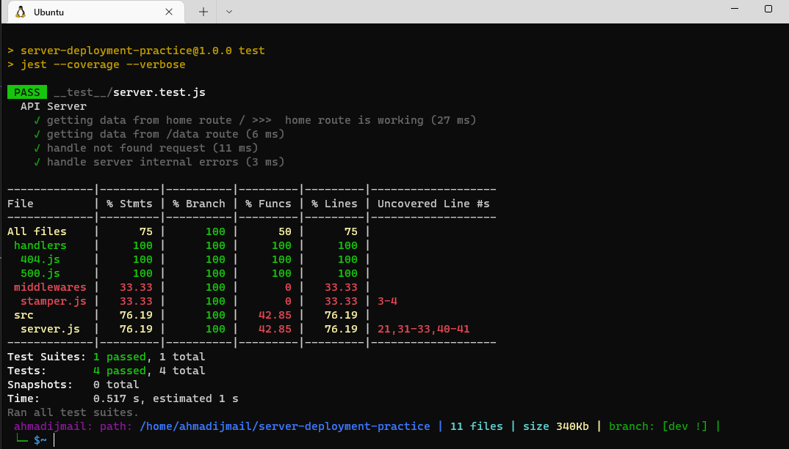

# server-deployment-practice

## Instructor Notes:

1- create a repo Including (README.md, .gitignore and MIT license)  
2- Create action in Github "Node.js" so it will create .yml file and add the branch you want to be inculded and in our case we will add **dev** branch.  
3- clone the repo to our local machine and buld the server.  
4- Install requierd Packages.  
4- Testing the server:    
  

4- Do **ACP**

## Required Links: 

1- [ahmadijmail-server-deploy-dev](https://ahmadijmail-server-deploy-dev.herokuapp.com/)  
2- [ahmadijmail-server-deploy-prod](https://ahmadijmail-server-deploy-prod.herokuapp.com/)  
3- [Github actions](https://github.com/ahmadijmail/server-deployment-practice/actions)  
4- [Pull Request](https://github.com/ahmadijmail/server-deployment-practice/pulls)  

